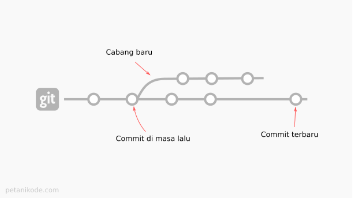
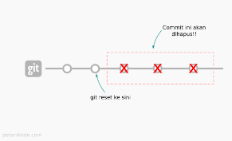
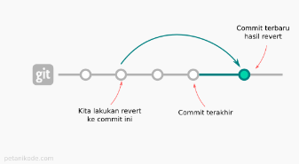

# Week 4
## _Tugas Writing & Presentation test Week 4_ ✨


## **Git dan GitHub Lanjutan**
- `Git` merupakan tools untuk programmer yang digunakan untuk mencatat setiap perubahan pada File (termasuk code yang kita buat) pada suatu proyek baik dikerjakan.
- `Command line` yang ada pada git
    - git init  -> membuat repository
    - git add . -> mencatat perubahan yg terlacak
    - git commit -m "message" -> membeeri pesan commit
    - git config --global user.email "adns@gmail.com"
    - git config --global user.name "adns"
    - git checkout (Membatalkan Perubahan - Belum Stagged dan Belum Commited)

        
    - git reset (Mengembalikan Commit Pada File Tertentu)

        
    - git revert (Membatalkan semua perubahan yang ada tanpa menghapus commit terakhir)

        
- Melakukan kolaborasi dengan menggunakan

    `Command line: git branch`
    - perintah untuk membuat branch
        ```
        git branch <branch>
        ```
    - perintah untuk membuat fitur register/membuat branch baru.
        ```
        git branch fitur_register
        ```
    - perintah untuk hapus sebuah branch
        ```
        git branch -d halaman_login
        ```

    `Command line: git merge`, untuk menyatukan pekerjaan ke master file/branch utama (branch MASTER)
    - lakukan checkout ke branch master terlebih dahulu
        ```
        git chechout master
        ```
    - lakukan merge
        ```
        git merge halaman_login
        ```

- **Menghindari konflik saat berkolaborasi**

    Untuk menghindari `conflict code` yang dikembangkan. Kita tidak boleh berkolaborasi dalam project di satu branch yang sama.Setiap fitur harus dibuat branchnya masing-masing, tidak boleh mengganggu branch ‘master’ yang sudah terupdate.


&nbsp;

## **Responsive Web Design (RWD)**
- `RWD` digunakan agar design website yang kita buat dapat diakses dalam device apapun (laptop/PC, smartphone, tablet, dll).
- `Tools` yang ada pada RWD
    - Viewport
    - Max-width element
    - Media Query (min-width dan max-width)
    - Breakpoint
    - Important notes
    - Flexbox dan Grid
    - Relative CSS Unit
&nbsp;

## **Bootstrap 5**

&nbsp;
- `Bootstrap` merupakan framework website development berbasis HTML, CSS, serta JavaScript yang dirancang untuk memesatkan proses pengembangan website responsive serta mobile- first (memprioritaskan fitur seluler). Tidak hanya dapat digunakan untuk meningkatkan web dengan lebih cepat, Bootstrap merupakan framework gratis yang bersifat open-source. 